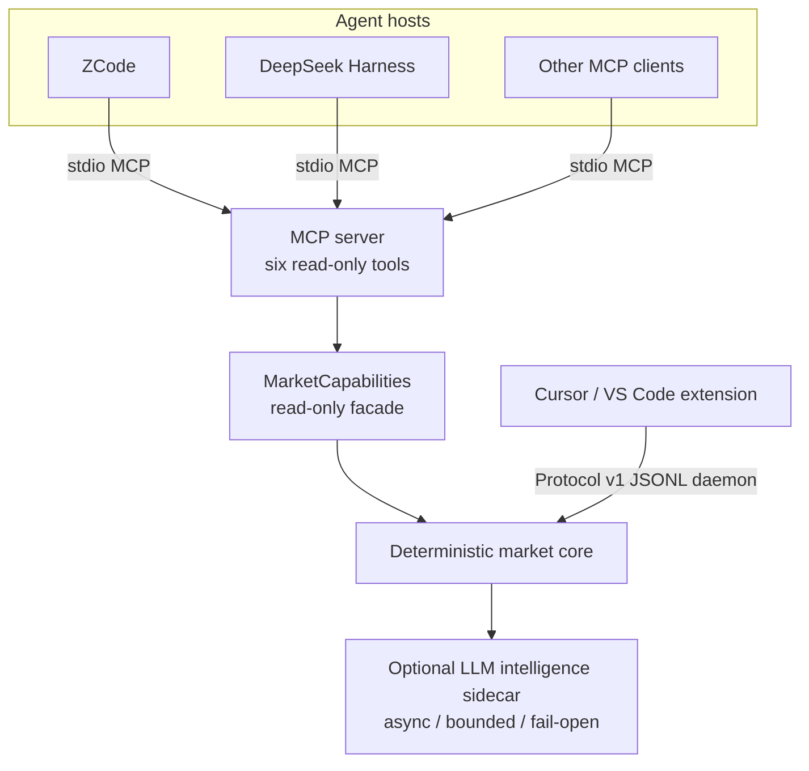

# MarketSentinel

[](https://github.com/vagabond-zzz/MarketSentinel/actions/workflows/ci.yml)

Deterministic real-time market monitoring with a read-only MCP capability layer for AI agents.

MarketSentinel watches a small watchlist of symbols and turns raw quotes into features, events, and signals with fully deterministic code. The resulting state is exposed three ways: a CLI, a low-latency Cursor / VS Code host protocol, and a standard MCP server that agent hosts such as ZCode and DeepSeek Harness consume. An optional LLM intelligence layer runs as a bounded asynchronous sidecar — it may annotate signals, but it never decides what happened and never touches the market pipeline.

This is developer-oriented infrastructure. The system observes, explains, and records. It does not trade, does not let an agent trade, and does not let an agent mutate runtime configuration.

| | |
|---|---|
| Package | `market-sentinel` 0.7.0 (wire protocol v1) |
| License | MIT — [LICENSE](LICENSE) |
| Python | 3.12+, zero core runtime dependencies |
| Agent hosts verified | ZCode 0.16.9 · DeepSeek Harness 0.2.0-rc.2 (stdio MCP) |
| Status | Working system; GitHub Actions CI in place; GitHub release pending owner approval |

## Why this architecture

> Let deterministic systems decide what happened; let models help explain what it means.

- Tick handling, state transitions, event detection, and signal lifecycle are deterministic code — testable, reproducible, observable, and cheap.
- The LLM never sits in the high-frequency path. It runs as an asynchronous, bounded sidecar: at most one model call per signal episode, structured output validated, trading advice rejected fail-closed, deterministic fallback to rules-only on any failure.
- Agents read state through a stable, read-only capability layer. They can observe, inspect, explain, and investigate; they cannot mutate market state, mutate configuration, or execute anything.
- MCP is an adapter, not a second brain: each tool maps one-to-one onto the capability layer and core semantics are unchanged.

## Architecture



The deterministic core, once per tick:

```text
Provider → Normalization → Ring buffer → Features
        → Event rules → Dedupe → Cluster / Signal composition → Cooldown
        → Warming policy / Adaptive scheduler → MarketState
        → CLI / Protocol v1 host / MCP capabilities / Telemetry
```

Two consumption paths, deliberately different:

- **Cursor / VS Code extension** — the low-latency host: spawns the Python core as a `market-sentinel daemon` child and speaks a versioned JSONL protocol (pushed updates, pause/resume, feedback, alert edges).
- **MCP server** — the agent-facing reader: a standalone runtime that owns its own engine and tick loop and serves six read-only tools over stdio. It does not attach to the Cursor daemon, writes no telemetry, and required no changes to the deterministic core.

Frozen data semantics, event/signal rules, and provider contracts live in [docs/architecture/](docs/architecture/) — the README deliberately does not duplicate them.

## The MCP capability layer

MarketSentinel exposes **exactly six read-only tools**:

| Tool | Returns |
|---|---|
| `get_market_state` | Whole-watchlist snapshot: prices, features, scheduler levels, feed status, replay progress |
| `get_symbol_state` | One watched symbol's snapshot |
| `get_active_signals` | Signals still inside their episode lifecycle, grouped by symbol |
| `get_signal` | One active signal, including its intelligence annotation when present |
| `get_feed_health` | Per-symbol `LIVE / DELAYED / STALE / DISCONNECTED` plus the worst-of aggregate |
| `get_recent_events` | Recently accepted market events, bounded and chronological (no rule internals) |

Connected through MCP, an agent can **inspect and reason**: current market state, per-symbol detail, active signals and their annotations, feed health, and the recent event flow — all as structured JSON.

What is intentionally absent from the surface:

- no write, configuration, tuning, or trading tools
- no shell, filesystem, or arbitrary-code-execution tools
- no watchlist or runtime mutation
- no credentials in tool output
- no MCP resources or prompts — tools only

Errors are machine-mappable rather than stringly typed: capability failures return `{"ok": false, "error": {"code": ..., "message": ...}}` with stable codes (`not_found`, `invalid_argument`, `not_running`, `unavailable`, `timeout`, `internal`); argument-type violations are rejected by the MCP schema layer before the tool runs. The server never writes non-protocol content to stdout — diagnostics go to stderr.

## Quick start

Prerequisites: Python 3.12+ and [uv](https://docs.astral.sh/uv/). Node.js and pnpm are only needed for extension development.

```bash
git clone https://github.com/vagabond-zzz/MarketSentinel.git
cd MarketSentinel
uv sync
```

None of the following needs an API key or network access:

```bash
uv run market-sentinel --help
uv run market-sentinel demo      # deterministic full-pipeline walkthrough
uv run market-sentinel doctor    # environment diagnostics
```

`demo` replays a bundled three-symbol scenario through the real engine — fake clock, fake intelligence provider, in-memory telemetry, no files written — and prints what each stage produced, followed by the capability-layer views. Expected output includes 43 replay batches, 55 accepted events, and 18 signal episodes; it is deterministic apart from runtime UUIDs.

### As an MCP server

```bash
uv sync --extra mcp              # the core install does NOT include the MCP SDK
uv run market-sentinel mcp       # stdio: protocol on stdout, logs on stderr
```

Point any MCP client at that command over stdio. Ready-made client fragments (ZCode, generic `mcpServers` clients, DeepSeek Harness) live in [examples/mcp/](examples/mcp/); full tool/error/telemetry semantics in [docs/integrations/mcp.md](docs/integrations/mcp.md).

Windows note: a running MCP server locks the venv's `market-sentinel.exe` — stop the host session (or kill the server processes) before `uv sync` or upgrades.

## Host integrations

| Host | Status | Verified version | Notes |
|---|---|---|---|
| ZCode | VERIFIED | 0.16.9 | stdio MCP, six read-only tools — [docs/integrations/zcode.md](docs/integrations/zcode.md) |
| DeepSeek Harness | VERIFIED | 0.2.0-rc.2 | stdio MCP via its built-in `dsh-mcp-client` — [docs/integrations/deepseek-harness.md](docs/integrations/deepseek-harness.md) |

These are the host versions actually exercised end-to-end — tool discovery, all six tool calls, error propagation, replay event flow, agent-level tool use, negative permission tests, and lifecycle — not promises about future host versions. DeepSeek Harness remains a developer preview. Integration happens through **standard MCP server configuration**, not host-specific plugins.

## Deterministic core + bounded LLM sidecar

Why not put an LLM in the tick loop? Unbounded latency, unbounded failure modes, poor reproducibility, uncontrolled cost — and a model must never become the source of truth for market state.

So the path is:

```text
deterministic core → bounded asynchronous intelligence → structured capability layer → agent
```

The intelligence sidecar (optional, off by default) is constrained by design: a deterministic router selects candidates, the episode budget allows at most one model call per signal episode, structured output is validated and trading advice is rejected fail-closed, every failure mode has a named fallback reason, and any failure degrades to rules-only without affecting signals, alerts, or state. The frozen contract: [docs/architecture/intelligence-contract.md](docs/architecture/intelligence-contract.md).

## Safety and non-goals

MarketSentinel is **not**:

- a trading execution system or a brokerage integration product
- an autonomous trading agent
- a system where an LLM mutates market state
- a system where an MCP client can execute shell commands, code, or filesystem operations
- a replacement for exchange or broker risk controls

The MCP surface is intentionally read-only: agents observe, inspect, explain, and investigate — nothing else. The boundary is enforced by the capability layer itself (there is no write tool to call) and was verified with negative tests in both host verifications.

## Observability

Every pipeline stage records structured telemetry (18 event types) as local append-only JSONL under an explicit privacy allowlist, next to explicit user feedback labels, a read-only evaluation report (`market-sentinel telemetry report`), and offline tuning that compares candidate configurations on a fixed replay corpus without ever auto-applying them. Contracts: [docs/architecture/metrics-contract.md](docs/architecture/metrics-contract.md).

## Verification snapshot

All numbers are a point-in-time snapshot (M6, 2026-10-05), not a permanent guarantee:

- Python suite: **726 passed, 5 deselected** — offline by default, live vendor tests opt-in; coverage gate 85%
- Extension: **21 test files / 200 tests** (vitest, including real core-process integration tests) plus typecheck, lint, and build
- Packaging: wheel and sdist verified; fresh-venv install verified; `[mcp]` and `[live]` optional-dependency boundaries verified — [docs/RELEASE_READINESS.md](docs/RELEASE_READINESS.md)
- MCP stdio: protocol-level integration test (initialize → tools/list → tool calls → clean shutdown, stdout purity enforced)
- Host verification: ZCode 0.16.9 and DeepSeek Harness 0.2.0-rc.2, end-to-end (see the host table above)

## Repository layout

```text
src/market_sentinel/
  market_data/            providers (fake / replay / longbridge), normalization, session
  features/ events/ signals/   deterministic pipeline stages
  scheduler/ runtime/ health/  warming, adaptive scheduling, feed health
  capabilities/           read-only facade — the stable agent boundary
  mcp_server/             MCP stdio server (optional [mcp] extra)
  ipc/                    Protocol v1 JSONL daemon (Cursor host)
  intelligence/           bounded async LLM sidecar
  cli/                    run / watchlist / daemon / demo / doctor / mcp / telemetry / tuning
  telemetry/ evaluation/ tuning/   local observability loop
  domain/ watchlist/ data/         frozen models, watchlist, demo fixture
apps/cursor-extension/      VS Code / Cursor host (TypeScript)
tests/                      unit + offline integration + replay fixtures
tools/                      developer probes (live vendors) and benchmarks
docs/                       architecture contracts, integration guides, usage guide, history
examples/mcp/               MCP client configuration fragments
```

## Development

```bash
uv run pytest                                  # offline suite
uv run ruff check . && uv run ruff format --check .
pnpm install
pnpm test && pnpm typecheck && pnpm lint && pnpm build
```

Workflow and engineering invariants: [CONTRIBUTING.md](CONTRIBUTING.md). Long-standing agent rules: [AGENTS.md](AGENTS.md). Documentation index — architecture contracts, integration guides, the [中文使用手册](docs/usage.zh.md), and project history: [docs/README.md](docs/README.md). Security model and reporting: [SECURITY.md](SECURITY.md).

## Current limitations

- Telemetry and feedback are local JSONL files: no server, no database, no sync.
- The Cursor extension is a local developer VSIX — not published to any marketplace — and the Python core is not bundled into the VSIX.
- Live data: Longbridge is the only wired live provider (credentials via environment variables); the `http` provider is an explicit stub; Tencent/Sina are developer probes only.
- Adaptive polling produces sampled, observed 1-minute bars — not exchange-official candles; `alerts_per_market_hour` is defined for A-shares only.
- `get_signal` sees only signals inside their episode lifecycle (no history store by design); `get_recent_events` is fed by the runtime's own tick loop, so it is empty under the static fake provider — use a replay fixture to see the event flow.
- Host verification is version-specific (ZCode 0.16.9; DeepSeek Harness 0.2.0-rc.2, developer preview); other host versions are unverified.
- CI covers tests, lint, packaging, and dependency boundaries — not host integrations, live vendors, or GUI behavior (those are verified out of band, see the host table above).

## Roadmap

- **CI** — GitHub Actions quality gates are in place (tests, lint, packaging, fresh-install and MCP-boundary smoke; see `.github/workflows/ci.yml`). Host integrations, live vendors, and GUI behavior remain out of band.
- **M9** — clean-room external audit: fresh clone → install → verify everything against the README
- GitHub Release / tag — after owner approval; **PyPI: not scheduled**

No agent loops, write tools, trading, MCP resources/prompts, or multi-agent features are planned for the MCP surface.

## License

[MIT](LICENSE) — Copyright (c) 2026 MarketSentinel contributors.
